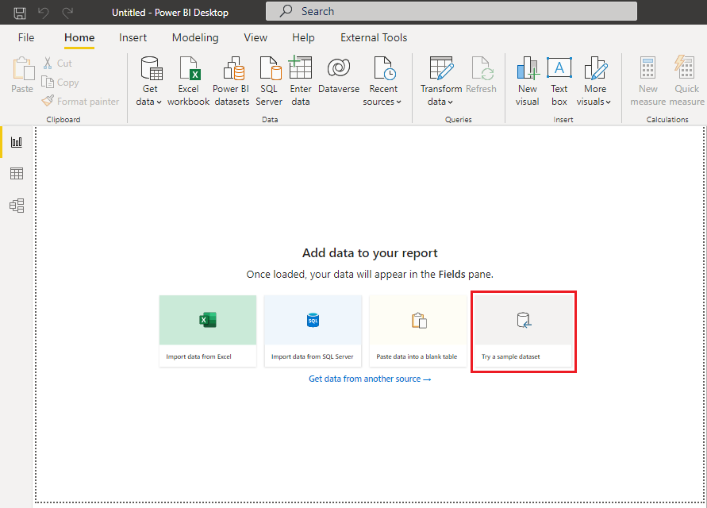
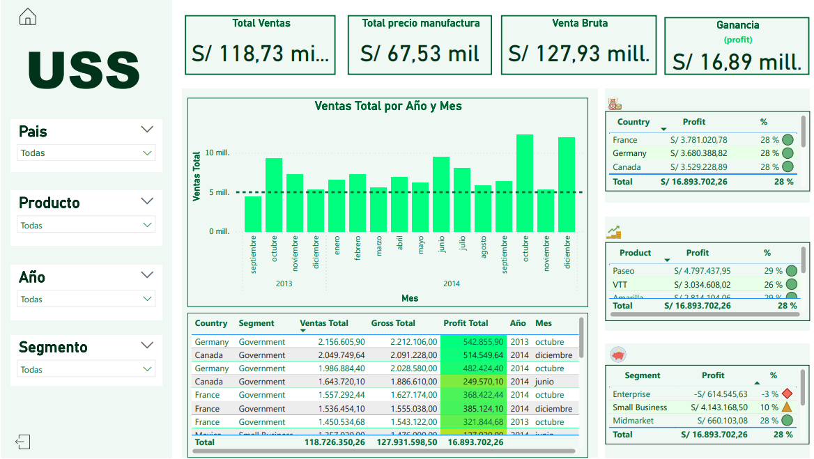

---

---
# 📊 Analítica de Datos – Clase N° 2

---
## 🛠 Herramientas utilizadas
- **SQL Server** – Para la gestión y consulta de bases de datos.
- **Power BI** – Para la visualización y análisis de datos.
- **Excel** 

---
## 🎯 Tema
**Business Intelligence (BI)**

## 📚 Contenido Teórico

1. **Definición de Business Intelligence (BI):**  
    BI reúne procesos, tecnologías y herramientas para convertir datos en información valiosa.
    
2. **Ciclo de Vida del BI:**
    
    - Captura de datos
        
    - Integración y limpieza (ETL)
        
    - Almacenamiento (Data Warehouse)
        
    - Análisis
        
    - Visualización
        
    - Toma de decisiones
        
3. **Sistemas Transaccionales vs Analíticos:**
    
    - OLTP: transacciones, datos en tiempo real
        
    - OLAP: análisis, datos históricos
        
4. **Data Warehouse:**  
    Repositorio centralizado orientado a análisis de datos.
    
5. **Data Mart:**  
    Subconjunto de un DW, enfocado en áreas específicas.

# Documentación práctica

## Descargue el libro de trabajo de Financial Sample Excel para Power BI
Puede descargar directamente el [Muestra financiera Libro de Excel](https://go.microsoft.com/fwlink/?LinkID=521962).

O simplemente en la opcion *Usar datos de muestra* 

1. En el **Dos formas de utilizar datos de muestra** diálogo, elija **Cargar datos de muestra**.
2. En el **Navegador**, seleccione datos en el panel izquierdo, como **Financieros**, y el elegir **Carga**.

### Manejo del programa
1. En el apartada de *Visualización* agregar **tarjeta**
	1. Esta tarjeta se le setea una medida.
2. Practico: *Agregar un grupo de medidas* -> Data Set
	1. Inicio -> *Introducir Datos* (crea una nueva tabla)
	2. En el apartado de datos observamos nuestra nueva tabla, vamos a la tabla y abrimos en los ... mas opciones y le damos a *nueva medida*
	3. en la barra de *formulas DAX* agregamos `Gross Total = SUM(financials[Gross Sales])` y asi para todas la medidas que queramos.
	4. Eliminar la columna que crea por defecto el *introducir datos*
	5. Agregar una nueva columna para sacar porcentaje de ganacia:
		1. `% profit = financials[Profit] / financials[Sales]`

