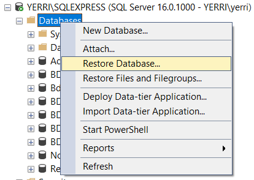
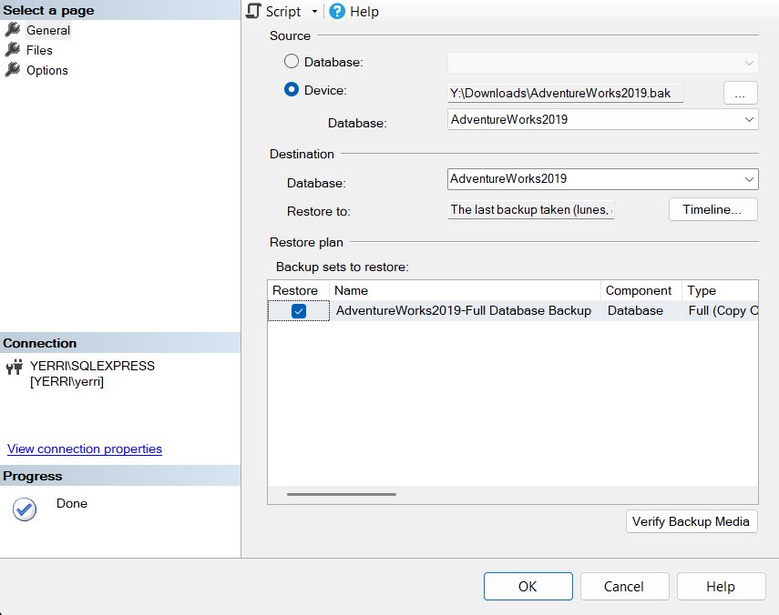

# Documentación práctica
## Descarga de archivos de copia de seguridad

descarga de la version *OLTP* [AdventureWorks2019.bak](https://learn.microsoft.com/es-es/sql/samples/adventureworks-install-configure?view=sql-server-ver16&tabs=ssms)

---
## Restauración en SQL Server
Puede usar el archivo `.bak` para restaurar la base de datos de ejemplo en la instancia de SQL Server.
## En el SSMS
 1. Haga clic con el botón derecho en **Bases de datos** en **Explorador de objetos**>**Restaurar base de datos...** para iniciar el asistente **Restaurar base de datos**.

2. 1. Seleccione **Dispositivo** y, luego, los puntos suspensivos **(...)** para elegir un dispositivo.
3. Seleccione **Agregar** y, a continuación, elija el archivo `.bak`
4. Seleccione **Aceptar** para confirmar la selección de copia de seguridad de la base de datos y cierre la ventana **Seleccionar dispositivos de copia de seguridad**.
5. Marque la pestaña **Archivos** para confirmar que la ubicación **Restaurar como** y los nombres de archivo coinciden con la ubicación y los nombres de archivo previstos en el Asistente para **restaurar bases de datos**.
6. Seleccione **Aceptar** para restaurar la base de datos.

